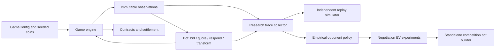

# QuantStorm: Divided Oracle Strategy Research

Exact probability trading bots and a reproducible research layer for the
Divided Oracle competition game. Two players reveal private coin information,
bid tactical energy for powers, and negotiate contracts on a hidden score.
The objective is to price uncertainty and allocate a finite auction budget
while respecting the game's information and action constraints.

This is a Python simulation and strategy project. It uses no neural network,
GPU, external market feed, or trained ML checkpoint.

## Implemented capabilities

- Deterministic deals and mirrored matches with zero-sum settlement.
- Exact finite Rademacher score distributions and final-turn contract EV.
- Adaptive auction shading, quote inference, and TRANSFORM denial strategies.
- A standalone baseline bot and an experimental bot with embedded empirical
  opponent tables and a conservative pre-final-turn EV override.
- Independent research mechanics, observation/action tracing, and replay parity.
- Conditional-frequency opponent models with smoothing and seed-based validation.
- Static submission checks and process isolation supplied by the competition stack.

## Architecture



The root engine and rules are preserved numerically from the original research
workspace. The archived competition checkout has a different engine version;
do not substitute it when comparing research results. See [provenance](docs/PROVENANCE.md).

## Setup

Use CPython **3.11 or newer**. Local verification used Python **3.14.7 on Windows**.
There are no third-party runtime or test dependencies.

```bash
python -m venv .venv
```

Activate with `.venv\Scripts\Activate.ps1` in PowerShell or
`source .venv/bin/activate` on Linux/macOS. Run the commands below from the
repository root. No credentials or environment file are needed.

## Recommended execution path

```bash
python -B backtester.py --n_deals 5 --seed 42 --quiet
python -B tools/run_tests.py
python -B research/baseline/run_baseline.py
```

The backtester defaults to `strategies/adaptive_standalone.py` versus
`strategies/rational.py`. Default paths also work when launched from another
directory. Explicit `--bot1` and `--bot2` paths are relative to the caller.
Mirroring is enabled by default; use `--no_mirror` to disable it.

```bash
python -B backtester.py --bot1 strategies/adaptive_standalone.py --bot2 strategies/naive_ev.py --n_deals 5 --seed 42 --quiet
python -B backtester.py --bot1 strategies/adaptive_competition.py --bot2 strategies/rational.py --n_deals 2 --seed 42 --quiet
```

The modular `strategies/adaptive_final.py` remains available through direct
Python imports and the research harness. The competition loader disallows
project-local imports, so use the standalone bot with the CLI.

`--validate FILE` performs the tournament static gate. Example bots deliberately
contain placeholder participant metadata; replace it with your own metadata
before submitting. The current static gate accepts these example strings, so
a successful check does not verify participant identity. `--isolate` applies
tournament process rules. In-process matches should only run trusted code.

## Data, models, and evaluation

The baseline needs only generated fair coins. Historical research used a
locally generated roughly 92 MB observation/action dataset, originally copied
into three locations. Those copies remain local and are excluded from Git.
There is no external dataset download to invent or checkpoint to obtain.

Generate research trajectories and fit the transparent opponent model:

```bash
python -B research/opponent/run_phase3.py
python -B research/opponent/analyze.py research/results/phase3_policy_dataset.json
python -B research/ev/phase4c.py --input research/results/phase3_policy_dataset.json
python -B build_competition_bot.py
```

These full research reruns are **not re-executed during reconstruction**.
The collector uses three reference pairings, 1,000 direct deals per pairing,
mirrors, and seed 930000. The builder embeds tables into
`research/results/adaptive_competition_generated.py`; it does not require the
dataset at bot runtime. Existing generated bot behavior was smoke tested.
Research commands generally write under `research/results/`, so retain a copy
of historical reports before running them. The baseline writes a distinct
`phase1_baseline_reproduced.json` to preserve its original evidence.
Historical policy exports include seed ranges different from the collector's
current defaults; regenerating trajectories is not guaranteed to reproduce
those original exports byte for byte. No dataset splits were changed.

## Verified results

Reproduced with seed **900001**, 100 direct plus 100 mirrored deals per opponent,
the standalone AdaptiveFinal strategy, and the unchanged root game rules:

| Opponent | Total PnL | PnL per deal | Warnings / violations / clamps |
| --- | ---: | ---: | --- |
| Rational | +567.6700119050304 | +2.838350059525152 | 0 / 0 / 0 |
| AdaptiveBidder | +185.55999999999995 | +0.9277999999999997 | 0 / 0 / 0 |
| NaiveEV | +585.6700119050302 | +2.9283500595251506 | 0 / 0 / 0 |

All three historical baseline PnLs reproduced exactly; runtime measurements are
machine dependent. These are seeded game outcomes, not general trading returns
or proof of tournament superiority. Original evidence is in
[phase1_baseline.json](research/results/phase1_baseline.json).

All **14 test programs** passed, including 5 new runtime regression tests.
They cover exact probability/EV, frozen configuration, deterministic zero-sum
matches, loader startup, path handling, independent mechanics and trace parity,
and small empirical-policy fixtures. The published GitHub Actions matrix for
Windows/Linux and Python 3.11/3.14 completed successfully.
See [verification](docs/VERIFICATION.md).

## Repository map

```text
engine.py, game_config.py      preserved research execution oracle and rules
exact_value.py                exact score probability mathematics
exact_negotiation.py          exact final-turn action EV
backtester.py                 recommended match CLI
bot_loader.py, policy.py       competition loading and static validation
sandbox.py, limits.py          process/resource enforcement
strategies/                   baselines, modular variants, standalone bots
research/                     simulator, empirical policies, EV studies, reports
research_harness.py            parallel seeded evaluation
*_sweep.py, final_robustness.py original parameter-study entry points
build_competition_bot.py        empirical model embedding
tests/, tools/                 regressions and complete test runner
experiments/archive/           unsupported historical execution snapshots
docs/                          migration, provenance, verification
```

## Research history and limitations

Read [EXPERIMENTS.md](EXPERIMENTS.md) for meaningful alternatives, calibration,
action audits, and negative findings. Large sweep claims in original comments
have no retained raw logs and are not independently verified here. The exact
counter policy showed strong overconfidence in its historical sanity report;
the experimental competition bot is not promoted over the reproduced baseline.

The root sanitizer permits response widths below `final_cap`, including zero;
the research model deliberately matches this actual behavior. The stale test
that required width >= `final_cap` was corrected without changing mechanics.
Replay parity currently covers a limited trajectory, not exhaustive state space.
OS sandbox enforcement requires further platform validation and should not be
treated as a general-purpose security sandbox.

Future work: wider seeded parity coverage, calibration on unseen opponents,
paired multi-seed strategy comparisons, and validated submission metadata.

## Attribution and publication

Competition infrastructure originated from
[vishwasmiddha/quantstorm-ps](https://github.com/vishwasmiddha/quantstorm-ps).
No explicit upstream license was found in the local checkout. No new license
is granted; redistribution rights require confirmation. Sponsor imagery and
participant identifiers are excluded or replaced with placeholders.

Original files, nested Git history, and the detailed inventory/reconstruction
report are preserved locally in ignored `.reconstruction/`. The nested remote
is not a publication target. The intended new repository is **private**.
