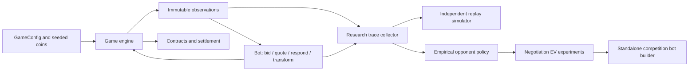

# QuantStorm: Divided Oracle Strategy Research

Exact probability trading bots and a reproducible research layer for the
Divided Oracle competition game. Two players reveal private coin information,
bid tactical energy for powers, and negotiate contracts on a hidden score.
The objective is to price uncertainty and allocate a finite auction budget
while respecting the game's information and action constraints.

This is a Python simulation and strategy project. It uses no neural network,
GPU, external market feed, or trained ML checkpoint.

## Contents

- [Problem and game mechanics](#problem-and-game-mechanics)
- [Implemented capabilities](#implemented-capabilities)
- [Architecture](#architecture)
- [Setup](#setup)
- [Recommended execution path](#recommended-execution-path)
- [Strategy design](#strategy-design)
- [Python API and configuration](#python-api-and-configuration)
- [Data, models, and evaluation](#data-models-and-evaluation)
- [Research workflow](#research-workflow)
- [Verified results](#verified-results)
- [Testing and reproducibility](#testing-and-reproducibility)
- [Repository map](#repository-map)
- [Troubleshooting](#troubleshooting)
- [Research history and limitations](#research-history-and-limitations)
- [Attribution and publication](#attribution-and-publication)

## Problem and game mechanics

Divided Oracle combines incomplete information, market making, negotiation,
and resource allocation. A strategy must estimate the hidden settlement score,
interpret the opponent's prices, choose whether to accept or counter, and
decide which powers justify spending a limited tactical-energy budget.

### A deal in the default configuration

1. The engine generates **40 independent fair coins**, each valued at `-1` or
   `+1`, and distributes 20 to each seat. The final score is the sum of all
   40 coins; it lies between -40 and +40 on an even-valued lattice.
2. A deal contains **five rounds**. Each round reveals four additional coins
   from each player's own hand. Bots receive immutable observations of their
   legal information, rather than the hidden complete hands.
3. The engine draws one eligible tactical power for a blind auction. Both
   players begin the deal with **24 tactical-energy points**. Winning bids
   consume energy; equal positive bids use the configured coin-flip rule.
4. A Maker posts a bid/ask range. Players negotiate for up to **six turns**,
   accepting a side or countering within the current range. If neither accepts,
   the engine applies a forced midpoint fill, fees, and relevant power shifts.
5. Contracts settle against the hidden score. The engine also accounts for
   Maker obligations, opening-width premiums, power effects and remaining-energy
   salvage. Settlement preserves the zero-sum invariant between seats.

Mirrored matches replay a deal with swapped information/roles to reduce seat
asymmetry. A request for `--n_deals 5` therefore produces **10 played deals**
when mirroring is enabled.

### Tactical powers

| Power | Role in the game | Default eligibility |
| --- | --- | --- |
| `FORESIGHT` | Provides information about the opponent's revealed coins, subject to the available revealed hand. | Rounds 1–5 |
| `TRICK_ROOM` | Shifts a forced execution price in the holder's favor. | Rounds 1–5 |
| `SUBSTITUTE` | Limits the holder's loss for that round. | Rounds 1–5 |
| `STEALTH_ROCK` | Creates a persistent forced-fill shift for later rounds. | Rounds 1–4; once per deal |
| `TRANSFORM` | Allows a hand swap, whose value depends on current information and remaining rounds. | Rounds 1–3; once per deal |

Eligibility is not a fixed schedule: the root configuration uses a drawn slate.
See [RULEBOOK.md](RULEBOOK.md) for competition context and
[game_config.py](game_config.py) / [engine.py](engine.py) for the executable
research rules. The archived competition checkout uses a different engine
version, so its outputs are not interchangeable with root research results.

## Implemented capabilities

- Deterministic deals and mirrored matches with zero-sum settlement.
- Exact finite Rademacher score distributions and final-turn contract EV.
- Adaptive auction shading, quote inference, and TRANSFORM denial strategies.
- A standalone baseline bot and an experimental bot with embedded empirical
  opponent tables and a conservative pre-final-turn EV override.
- Independent research mechanics, observation/action tracing, and replay parity.
- Conditional-frequency opponent models with smoothing and seed-based validation.
- Static submission checks and process isolation supplied by the competition stack.

## Architecture



The root engine and rules are preserved numerically from the original research
workspace. The archived competition checkout has a different engine version;
do not substitute it when comparing research results. See [provenance](docs/PROVENANCE.md).

## Setup

Use CPython **3.11 or newer**. Local verification used Python **3.14.7 on Windows**.
There are no third-party runtime or test dependencies.

### Clone the private repository

Authenticate Git with an account that has access to this repository, then run:

```bash
git clone https://github.com/preyash309/quantstorm-divided-oracle-research.git
cd quantstorm-divided-oracle-research
```

### Create a virtual environment

```bash
python -m venv .venv
```

Activate with `.venv\Scripts\Activate.ps1` in PowerShell or
`source .venv/bin/activate` on Linux/macOS. Run the commands below from the
repository root. No credentials or environment file are needed.

The environment is deliberately small: Python's `random`, `math`, `functools`,
`dataclasses`, `statistics`, `json`, `multiprocessing` and `concurrent.futures`
provide the simulation, exact calculations, empirical models and evaluation.
There is no `pip install` step, web server, notebook service or model download.

## Recommended execution path

```bash
python -B backtester.py --n_deals 5 --seed 42 --quiet
python -B tools/run_tests.py
python -B research/baseline/run_baseline.py
```

The backtester defaults to `strategies/adaptive_standalone.py` versus
`strategies/rational.py`. Default paths also work when launched from another
directory. Explicit `--bot1` and `--bot2` paths are relative to the caller.
Mirroring is enabled by default; use `--no_mirror` to disable it.

```bash
python -B backtester.py --bot1 strategies/adaptive_standalone.py --bot2 strategies/naive_ev.py --n_deals 5 --seed 42 --quiet
python -B backtester.py --bot1 strategies/adaptive_competition.py --bot2 strategies/rational.py --n_deals 2 --seed 42 --quiet
```

The modular `strategies/adaptive_final.py` remains available through direct
Python imports and the research harness. The competition loader disallows
project-local imports, so use the standalone bot with the CLI.

`--validate FILE` performs the tournament static gate. Example bots deliberately
contain placeholder participant metadata; replace it with your own metadata
before submitting. The current static gate accepts these example strings, so
a successful check does not verify participant identity. `--isolate` applies
tournament process rules. In-process matches should only run trusted code.

### Backtester options

| Option | Purpose |
| --- | --- |
| `--bot1 FILE`, `--bot2 FILE` | Select standalone strategy files defining a `Bot` class. |
| `--n_deals N` | Positive number of direct deals; mirrors double the played count. |
| `--seed N` | Fix the random seed for repeatable game trajectories. |
| `--mirror`, `--no_mirror` | Enable or disable mirrored deals. |
| `--quiet` | Hide step-by-step logs while keeping the match summary. |
| `--first_maker 0` or `1` | Override the first-round Maker seat. |
| `--coins VECTOR` | Supply exactly 40 comma-separated `+1`/`-1` values under default rules. |
| `--validate FILE` | Run the static submission gate without executing the file. |
| `--isolate` | Run bots in separate processes with tournament resource rules. |

Inspect the complete CLI with `python -B backtester.py --help`. For a short
isolated match or static check:

```bash
python -B backtester.py --n_deals 1 --seed 42 --quiet --isolate
python -B backtester.py --validate strategies/adaptive_standalone.py
```

The summary reports aggregate and per-deal PnL, wins/draws/losses, call timing,
warnings and a direct/mirror breakdown. Positive PnL favors the named bot;
the opposing seat receives the corresponding negative settlement.

## Strategy design

### Exact score mathematics

Given a known coin sum `k` and `n` unknown independent fair coins, the residual
sum has a finite binomial distribution:

```text
K ~ Binomial(n, 1/2)
S = k + 2K - n
P(S = k + 2j - n) = C(n, j) / 2^n, for j = 0, ..., n
E[S] = k
Var(S) = n
```

[exact_value.py](exact_value.py) caches this discrete distribution and provides
moments, interval/tail probabilities, ordinary contract EV, and loss-capped
SUBSTITUTE payoff calculations. With no fees or powers, buying at price `p`
has expected payoff `E[S] - p`; selling has `p - E[S]`. Nonlinear protections
are evaluated by summing their payoff over the full discrete distribution.

### Negotiation and inference

[exact_negotiation.py](exact_negotiation.py) compares final-turn acceptance and
forcing actions under the directly observed coin posterior. It incorporates
relevant loss caps and forced-fill shifts. This exact finite calculation does
not solve every earlier-turn strategic interaction: an earlier counter leaves
the opponent another decision to make.

Adaptive variants use opening-quote anchors as a heuristic signal of the
opponent's information. A quote-derived estimate is distinct from the exact
posterior based on directly observed coins. The research layer models that
remaining opponent-response uncertainty with conditional action frequencies.

### Auctions and frozen parameters

The strategy compares estimated power values against the opportunity cost of
spending tactical energy. AdaptiveFinal fixes global auction shade at **0.60**,
TRANSFORM shade at **0.60**, and TRANSFORM denial weight at **1.10**. These
parameters are preserved from the original project. Their supporting large-sweep
claims are not independently reproduced by the baseline verification.

TRANSFORM logic distinguishes buying a useful swap with a relatively flat hand
from buying the power to deny an apparent swap opportunity to the opponent.
Power effects are evaluated in the context of remaining rounds and information.

### Which implementation to use

| Implementation | Intended use | Execution path |
| --- | --- | --- |
| `adaptive_standalone.py` | Reproduced baseline and recommended match bot. | Backtester, static gate, isolated execution. |
| `adaptive_final.py` | Modular final strategy composed from research variants. | Direct Python import and research harness. |
| `adaptive_competition.py` | Experimental standalone bot with embedded opponent tables. | Backtester; smoke tested, superiority unproven. |
| `rational.py`, `naive_ev.py` | Reference opponent policies. | Backtester and research collection. |
| Other adaptive variants | Strategy progression and meaningful alternative approaches. | Programmatic evaluation; inspect imports before using the static gate. |
| `experiments/archive/` | Historical implementations and incompatible snapshots. | Unsupported archival evidence. |

The table-embedded candidate uses research overrides on pre-final turns only
when estimated improvement clears a conservative **0.35 EV gain** gate. It
retains the existing final-turn optimizer and otherwise falls back to the
base Adaptive policy. Its estimates include a one-step continuation
approximation; they are not a complete dynamic-programming solution.

## Python API and configuration

For custom matches, import trusted bot classes and pass an explicit
configuration to the engine:

```python
from engine import play_match
from game_config import GameConfig
from strategies.adaptive_standalone import Bot as AdaptiveFinal
from strategies.rational import Bot as Rational

config = GameConfig(TE_BUDGET=24)
result = play_match(
    AdaptiveFinal,
    Rational,
    config=config,
    seed=42,
    mirror=True,
    n_deals=5,
    verbose=False,
)

print("Played deals:", len(result.deals))  # 10
print("Aggregate PnL:", result.pnl)
assert abs(sum(result.pnl)) < 1e-9
```

`GameConfig` accepts validated keyword overrides and freezes itself after
construction. Change configuration by creating a new instance, rather than
mutating an instance passed to bots. Overrides may change the game being
evaluated; the published baseline uses the original defaults.

| Parameter | Default | Meaning |
| --- | ---: | --- |
| `N_COINS` / `N_PRIVATE` | 40 / 20 | Total coins and coins assigned to each seat. |
| `N_ROUNDS` / `REVEAL_PER_ROUND` | 5 / 4 | Reveal schedule for each player's hand. |
| `TE_BUDGET` / `TE_SALVAGE` | 24 / 0.08 | Energy per deal and residual-energy salvage rate. |
| `N_TURNS` / `MIN_REDUCTION` | 6 / 1 | Negotiation turns and minimum requested reduction. |
| `SLOTS_PER_ROUND` / `SLATE_MODE` | 1 / `draw` | Auction slate size and selection mode. |
| `FORCED_FILL_FEE` | 2.0 | Transfer paid by the forcing player. |
| `WIDTH_PREMIUM` | 0.22 | Premium associated with opening quote width. |
| `TIME_BUDGET_MS` / `HARD_TIME_LIMIT_MS` | 2.0 / 50.0 | Average-call budget and individual-call ceiling. |
| `BOT_MEMORY_LIMIT_MB` | 512 | Isolated-worker memory limit. |

`research/config.py` separately holds baseline seed/deal defaults; it does not
replace the game's rules. `MatchResult` contains deal outcomes, aggregate PnL,
call times, warnings, violations, clamps and forfeits. Each `DealResult`
contains score, contracts, remaining energy and seat PnL.

### Bot interface

A bot implements `reset(seat, config, seed)`, `bid(obs, offered)`,
`quote(obs)`, `respond(obs, quote, turn)`, and `use_transform(obs)`. Start from
[starter_bot.py](starter_bot.py) for the expected return formats.

The frozen observation exposes revealed coins, round/seat, remaining energy,
quote caps, current powers, public auction history, previous contracts,
FORESIGHT information and Maker status. It does not expose the true hidden
score or full private opposing hand. `reset` supplies a per-deal seed, and
isolated execution reloads submission source between deals.

## Data, models, and evaluation

The baseline needs only generated fair coins. Historical research used a
locally generated roughly 92 MB observation/action dataset, originally copied
into three locations. Those copies remain local and are excluded from Git.
There is no external dataset download to invent or checkpoint to obtain.

Generate research trajectories and fit the transparent opponent model:

```bash
python -B research/opponent/run_phase3.py
python -B research/opponent/analyze.py research/results/phase3_policy_dataset.json
python -B research/ev/phase4c.py --input research/results/phase3_policy_dataset.json
python -B build_competition_bot.py
```

These full research reruns are **not re-executed during reconstruction**.
The collector uses three reference pairings, 1,000 direct deals per pairing,
mirrors, and seed 930000. The builder embeds tables into
`research/results/adaptive_competition_generated.py`; it does not require the
dataset at bot runtime. Existing generated bot behavior was smoke tested.
Research commands generally write under `research/results/`, so retain a copy
of historical reports before running them. The baseline writes a distinct
`phase1_baseline_reproduced.json` to preserve its original evidence.
Historical policy exports include seed ranges different from the collector's
current defaults; regenerating trajectories is not guaranteed to reproduce
those original exports byte for byte. No dataset splits were changed.

## Research workflow

The research stack separates deterministic game mechanics from opponent
behavior and strategy optimization. Its progression is documented in
[EXPERIMENTS.md](EXPERIMENTS.md).

| Phase | Question | Principal modules |
| --- | --- | --- |
| 1: trace and baseline | Can legal observations/actions be captured without changing the engine outcome? | `research/simulator/trace_bot.py`, `runner.py`, `baseline/` |
| 2: independent mechanics | Can the same actions be replayed with matching score, energy, contracts and PnL? | `research/simulator/mechanics.py`, `simulator.py`, `replay.py` |
| 3: empirical opponent policy | How do reference bots act given their available information? | `research/opponent/collector.py`, `features.py`, `policy.py` |
| 4B/C: response conditioning | Do public state and the exact quote improve response predictions? | `research/ev/public_opponent.py`, `quote_opponent.py` |
| 4D: negotiation EV | Can predicted responses rank candidate counters by estimated continuation value? | `research/ev/negotiation_ev.py`, `continuation.py`, `phase4d.py` |
| 4D.1/4E: audits and sanity | Does action coverage hold, and are predictions calibrated? | `phase4d1_audit.py`, `phase4e0_counter_policy.py`, `phase4e1_policy_sanity.py` |
| Submission embedding | Can selected tables be deployed without loading the raw dataset? | `build_competition_bot.py` |

The empirical model uses conditional counts with smoothing. It is interpretable
and fits the discrete action/state setting without a neural training pipeline.
Features deliberately omit the true hidden score and private opposing hand.
Validation separates trajectories by seed, rather than randomly mixing action
rows from the same trajectories into train and validation sets.

### Building an experimental standalone bot

After creating a compatible dataset, select input and output paths explicitly:

```bash
python -B build_competition_bot.py --bot strategies/competition_base.py --dataset research/results/phase3_policy_dataset.json --output research/results/adaptive_competition_generated.py
python -B backtester.py --bot1 research/results/adaptive_competition_generated.py --bot2 strategies/rational.py --n_deals 5 --seed 42 --quiet
```

This build-and-run sequence is a reproducibility entry point; the full rebuild
was not rerun during reconstruction. Keep generated submissions separate from
the reproduced baseline. Replace example participant metadata before submitting.

### Historical policy evidence

The retained [Phase 4C report](research/results/phase4c_validation.json) evaluates
26,951 validation response rows. These historical figures have **not been
independently rerun**:

| Response model | Accuracy | Log loss | Brier score |
| --- | ---: | ---: | ---: |
| Public-state model, Phase 4B | 0.793254 | 0.582787 | 0.322069 |
| Quote-conditioned model, Phase 4C | 0.819042 | 0.549016 | 0.296497 |

The quote-conditioned report has an unseen-state rate of approximately 11.96%.
Accuracy measures response prediction, not match profitability. Later exact
counter-policy sanity evidence showed overconfidence, so richer action/state
representations are not treated as automatic improvements.

## Verified results

Reproduced with seed **900001**, 100 direct plus 100 mirrored deals per opponent,
the standalone AdaptiveFinal strategy, and the unchanged root game rules:

| Opponent | Total PnL | PnL per deal | Warnings / violations / clamps |
| --- | ---: | ---: | --- |
| Rational | +567.6700119050304 | +2.838350059525152 | 0 / 0 / 0 |
| AdaptiveBidder | +185.55999999999995 | +0.9277999999999997 | 0 / 0 / 0 |
| NaiveEV | +585.6700119050302 | +2.9283500595251506 | 0 / 0 / 0 |

All three historical baseline PnLs reproduced exactly; runtime measurements are
machine dependent. These are seeded game outcomes, not general trading returns
or proof of tournament superiority. Original evidence is in
[phase1_baseline.json](research/results/phase1_baseline.json).

All **14 test programs** passed, including 5 new runtime regression tests.
They cover exact probability/EV, frozen configuration, deterministic zero-sum
matches, loader startup, path handling, independent mechanics and trace parity,
and small empirical-policy fixtures. The published GitHub Actions matrix for
Windows/Linux and Python 3.11/3.14 completed successfully.
See [verification](docs/VERIFICATION.md).

## Testing and reproducibility

Run the complete supported suite using the custom runner:

```bash
python -B tools/run_tests.py
```

Most original tests are assertion-based programs whose `main()` executes the
checks. The runner executes each program directly; standard unittest discovery
alone would miss those checks. The five newer runtime regressions use unittest.

| Coverage | What is checked |
| --- | --- |
| Exact mathematics | Score PMFs, moments, probabilities, contract EV and protection effects. |
| Negotiation | Final-turn actions, candidate enumeration and small opponent-conditioned EV fixtures. |
| Research mechanics | State conversion, settlement, explicit actions, simulator startup and engine replay parity. |
| Opponent models | Conditional policy fitting and normalized predictions on representative small fixtures. |
| Runtime regressions | Deterministic zero-sum matches, frozen configuration, restored loader, cross-directory CLI startup and invalid deal counts. |

For a comparable experiment, record the bot implementations, configuration
overrides, seed range, direct/mirrored deal counts, opponent set and isolation
mode. Retain warnings, clamps, forfeits and timing alongside PnL. Compare
strategies with the same game rules and seed protocol. PnL is deterministic
under the tested conditions; timing measurements can vary with scheduling,
machine load and Python version.

The project CI runs the full suite on Windows/Linux with Python 3.11 and 3.14.
The reconstruction also verified all tests from a clean Git archive, ensuring
that ignored local datasets and caches were not required for the suite.

Large sweeps use `research_harness.py` and process workers. Their preserved
defaults can be expensive: for example, `final_robustness.py` runs 50 matches
of 1,000 direct deals, mirrored, for each selected opponent. Inspect the
parameters before starting them; they are not required for the quick start.

## Repository map

```text
engine.py, game_config.py      preserved research execution oracle and rules
exact_value.py                exact score probability mathematics
exact_negotiation.py          exact final-turn action EV
backtester.py                 recommended match CLI
bot_loader.py, policy.py       competition loading and static validation
sandbox.py, limits.py          process/resource enforcement
strategies/                   baselines, modular variants, standalone bots
research/                     simulator, empirical policies, EV studies, reports
research_harness.py            parallel seeded evaluation
*_sweep.py, final_robustness.py original parameter-study entry points
build_competition_bot.py        empirical model embedding
tests/, tools/                 regressions and complete test runner
experiments/archive/           unsupported historical execution snapshots
docs/                          migration, provenance, verification
```

Additional project records:

- [Experiment catalog](EXPERIMENTS.md): objectives, alternatives and available evidence.
- [Migration map](docs/MIGRATION.md): important original paths and relocation reasons.
- [Provenance](docs/PROVENANCE.md): upstream snapshots, engine selection and rights.
- [Verification record](docs/VERIFICATION.md): executed tests, results and boundaries.
- [Reconstruction report](docs/FINAL_REPORT.md): reconstruction and initial publication summary.

## Troubleshooting

| Symptom | Explanation and next step |
| --- | --- |
| Clone fails with repository not found | The repository is private. Authenticate an account with access and verify the remote URL. |
| A modular strategy fails the loader's import gate | Use `adaptive_standalone.py` through the backtester, or import the modular class directly for trusted research evaluation. |
| A research command cannot find its dataset | The large generated dataset is excluded from Git. Run the collector or supply a compatible local file using the command's supported input option. |
| Research imports or output paths fail | Run research scripts from the repository root and inspect their `--help` options. |
| `--n_deals 0` fails | Deal counts must be positive. Mirroring doubles the requested direct count. |
| `--coins` is rejected | Supply the configured total number of values, each exactly `+1` or `-1`; the default requires 40. |
| Windows reports access denied while creating an isolated-worker pipe | Check execution-environment permissions. During reconstruction, the restricted workspace sandbox blocked the pipe; the approved external run succeeded. |
| Static validation passes placeholder metadata | The current gate checks its own metadata rules but does not verify identity. Replace all example participant fields before submission. |
| PnL differs from a historical report | Confirm engine version, bot file, configuration, seed, mirror setting and dataset generation protocol. Archived engines and modular/standalone variants are distinct implementations. |

## Research history and limitations

Read [EXPERIMENTS.md](EXPERIMENTS.md) for meaningful alternatives, calibration,
action audits, and negative findings. Large sweep claims in original comments
have no retained raw logs and are not independently verified here. The exact
counter policy showed strong overconfidence in its historical sanity report;
the experimental competition bot is not promoted over the reproduced baseline.

The root sanitizer permits response widths below `final_cap`, including zero;
the research model deliberately matches this actual behavior. The stale test
that required width >= `final_cap` was corrected without changing mechanics.
Replay parity currently covers a limited trajectory, not exhaustive state space.
OS sandbox enforcement requires further platform validation and should not be
treated as a general-purpose security sandbox.

Future work: wider seeded parity coverage, calibration on unseen opponents,
paired multi-seed strategy comparisons, and validated submission metadata.

## Attribution and publication

Competition infrastructure originated from
[vishwasmiddha/quantstorm-ps](https://github.com/vishwasmiddha/quantstorm-ps).
No explicit upstream license was found in the local checkout. No new license
is granted; redistribution rights require confirmation. Sponsor imagery and
participant identifiers are excluded or replaced with placeholders.

Original files, nested Git history, and the detailed inventory/reconstruction
report are preserved locally in ignored `.reconstruction/`. These backups are
specific to the original workspace and are not included in a fresh clone.
The published research repository is **private** at
[preyash309/quantstorm-divided-oracle-research](https://github.com/preyash309/quantstorm-divided-oracle-research).
Its default branch is `main`. The original upstream remote remains a provenance
reference, not a target for research publication.
